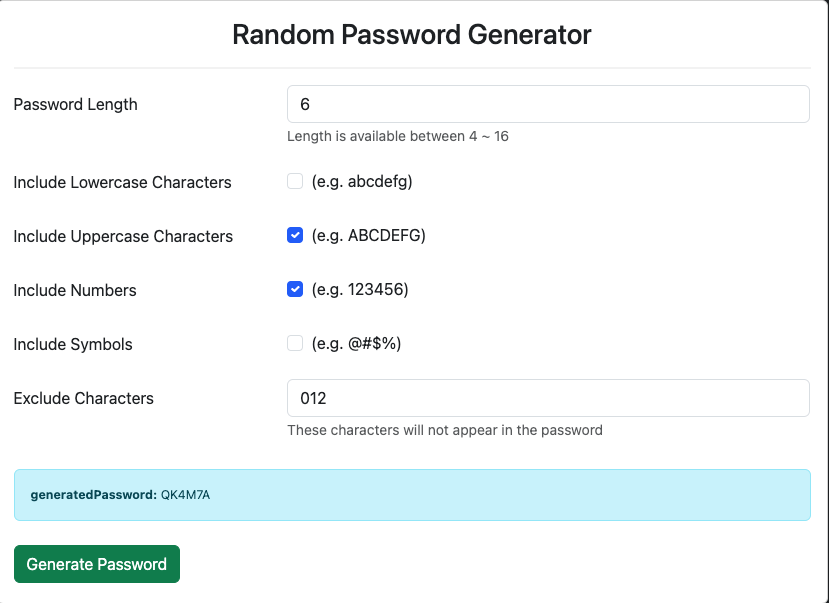
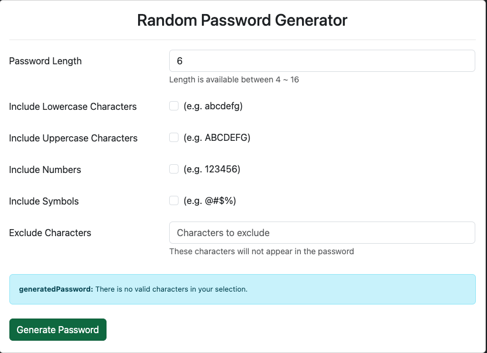
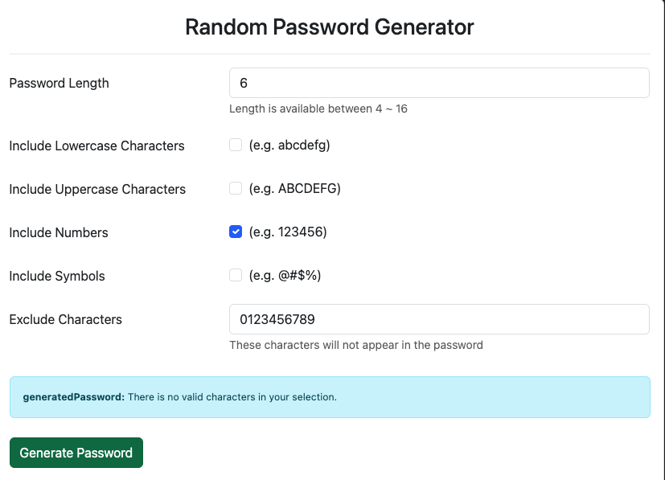

# 密碼產生器

這個專案是 AlphaCamp 全端網頁課程，後端開發實作 M7 章節的實作作業。主要是透過 Node.js、Express 框架、express-handlebars 樣板引擎，練習一個密碼產生器的應用程式（Web Applicaton）。

主要功能為：使用者可以依照偏好，設定密碼長度、是否想包含英文大小寫字母、阿拉伯數字、特殊符號，且可以設定不想出現在密碼中的特定字元，最後產生一組符合條件的密碼以供後續使用。

- 
- 
- 

## Getting Started

### Prerequisites

若要嘗試執行此份專案，環境部分您需要先準備以下（由於作者使用 macOS，以下指令以 macOS 為主）：

1. 安裝 Node Version Manager (nvm)

```
$ curl -o- https://raw.githubusercontent.com/creationix/nvm/v0.39.0/install.sh | bash
```

2. 使用 Node Version Manager (nvm) 安裝 node.js 並使用指定版本(`node.js @v18.15.0`)

```
$ nvm install 18.15.0
```

```
$ nvm use 18.15.0
```

3. 檢查是否有安裝成功，並確認 node.js 版本

```
node -v
```

### Installing

1. 將本專案從 GitHub Clone 到自己的本機，並切換到專案資料夾

```
git clone https://github.com/PoMingChen/AlphaCamp_C3_M7_PasswordInitiator.git
```

```
cd repository
```

2. 切換到專案資料夾後，執行 `npm install`，這樣所需的相依套件就會根據 `package.json` 文件中的指定版本安裝到本地端，讓專案可以順利運行。

## Running the tests

- 尚未實作

## Deployment

1. 啟動伺服器，執行 app.js 檔案

```
nodemon app.js
```

2. 開啟瀏覽器，並輸入以下網址 `http://localhost:3000`

## Built With

- [Node.js](https://nodejs.org/en)
- [Express](https://expressjs.com)
- [Express Handlebars](https://www.npmjs.com/package/express-handlebars)
- 前端網頁頁面設計，由 AlphaCamp 提供

## Contributing

- 無

## Versioning

- 無

## Authors

- [PoMingChen](https://github.com/PoMingChen)

## License

- 無

## Acknowledgments

- [AlphaCamp](https://tw.alphacamp.co/) 導師與助教群
